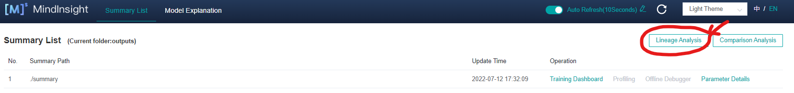

## Atlas 800 Training Cluster 

The Atlas 800 cluster features 4 Atlas 800 training servers (model:
9000). Each server is powered by the Kunpeng 920 and Ascend 910
processors. It features the industry's highest computing density,
ultra-high energy efficiency, and high network bandwidth. The server is
widely used in deep learning model development and training scenarios
and is an ideal option for computing-intensive industries, such as smart
city, intelligent healthcare, astronomical exploration, and oil
exploration.

The specification of each server node is summarized in the following table:

|**Form Factor**|4U AI server|
| :- | :- |
|**Processor**|4 Kunpeng 920 processors|
|**Processor Memory**|Up to 32 DDR4 DIMM slots, supporting RDIMMs<br>Up to 2933 MT/s<br>32 GB or 64 GB per DIMM|
|**AI Processor**|8 Ascend 910 processors|
|**HBM**|8 \* 32 GB|
|**AI Computing Power**|<p>2.56 / 2.24 / 2 PFLOPS FP16</p><p></p>|
**

## Atlas 800 Software stack

The Atlas 800 cluster is managed by Apulis AI Studio, which is an
end-to-end AI development platform that enables developers and data
scientists of any skill level to rapidly build, train, and deploy models
anywhere, from the cloud to the edge. As shown in the following figure,
the Apulis AI studio accelerates life cycle of AI development and
fosters AI innovation with key capabilities, including data
preprocessing, semi-automated data labeling, distributed training, and
automated model building.


## Objectives

This tutorial walks you through all the necessary steps required to build, train and evaluate et deep neural network on the Atlas 800 cluster


## Develop and Train Models in 'Code development' Project

-   From the home page of the Atlas AI Platform, Click on `AIArts`

> 

-   Click on `Projects` under `Project Management`` `to display an
    overview of all current user group tasks or jobs as shown in the
    following Figure:


-   Click on `New Project`, select the `Code Development` on the
    pop-window, setup a new code-development job. Give a name and a
    description for your new project as described in the following
    Figure:

> 

-   Click **Submit** to create your new project. In our case, the
    project name is ***cmctest***

-   From the list of the projects, click on the project you have just
    created (***cmctest*** in our case) as shown in the following
    Figure:


-   Start the code development environment in the project, and select
    the `image, dataset`, and `NPU quota` when starting the task

-   When code development job is `Running`, You can directly startup
    jupyter-lab or setup the Remote-SSH connection in your local IDE
    (Pycharm, VS Code, etc.).


-   In order to get the instructions for using the code development
    environment, including preset folder instructions, development
    instructions and model release instructions, click on the icon
     as shown in the following Figure:

> 

-   Click on **Jupyter** to start a Jupyter notebook session:


-   Click the  icon and upload the code package
    (**1495.tar.gz**) to the code development environment in the pop-up
    box.

-   Drag and drop the file **1495.tar.gz** to the submission window then
    click submit as shown in the following Figure:

> 

-   Use the following commands in the code development environment to
    unzip the code package, move the files to the code directory:

> tar -xf 1495.tar.gz
>
> mv /home/yhariri/code/1495/infer.yaml /home/yhariri/code/
>
> mv /home/yhariri/code/1495/manifest.yaml /home/yhariri/code/
>
> mv /home/yhariri/code/1495/code/\* /home/yhariri/code/

-   Execute the training script ***train.sh*** to start the training:

> bash train.sh \--batch_size=2 \--epoch_size=5 \--lr_init=0.01
> \--run_distribute=True \--dataset=cifar10
> \--data_path=/home/yhariri/adhub/mindspore/0.1/
> \--output_path=/home/yhariri/outputs/

The execution status is shown in the following Figure\


-   You can also startup a Mindinsight interactive port to execute a
    lineage analysis of summary logs. In order to do that, use the
    following commands to start Mindinsight service in Jupyter-Terminal:

> \#!/bin/bash
>
> \# Dependence：Mindpsore \<= v1.6, MindInsight \<= v1.6.1
>
> \# Listening port
>
> INTERACTIVE_PORT=8080
>
> \# Local summary log path
>
> SUMMARY_PATH=\$HOME/outputs
>
> \# Reload interval time
>
> INTERVAL=5
>
> \# Update the Mindinsight
>
> pip install -U mindinsight
>
> \# Setup the banding host and port
>
> sed -i \"s/HOST = \'127.0.0.1\'/HOST = \'0.0.0.0\'/g\"
>  \$HOME/.local/lib/python3.7/site-packages/mindinsight/conf/constants.py
>
> \# Startup service with specified local summary path
>
> mindinsight start \--port \$INTERACTIVE_PORT \--summary-base-dir
> \$SUMMARY_PATH \--reload-interval \$INTERVAL
>
> \# Or if you want to stop
>
> mindinsight stop \--port \$INTERACTIVE_PORT

-   Create the interactive port on the development task board:

    -   Click on New Port, then specify mindsight as a port name and
        8080 as Port number as shown in the following Figure:
        

```{=html}
<!-- -->
```
-   Launch the model evaluation process:

    -   Withing the pre-set demo, execute the evaluation commands as
        following steps:

> python3 eval.py \--dataset=cifar10
> \--data_path=/home/yhariri/adhub/mindspore/0.1/
> \--output_path=/home/yhariri/outputs/
> \--checkpoint_path=/home/yhariri/outputs/
>
> 

-   Check the files in the outputs folder and copy the ***infer.yaml***
    file from the code directory to the outputs folder.

> cp /home/yhariri/code/infer.yaml /home/yhariri/outputs/

-   Open Mindsight as shown in the following Figure:


-   Click on the Training Dashboard as shown in the following Figure:


-   A new window appears providing access to different visual
    information of the training:


-   Click on Lineage analysis to access more details about the training
    process:



-   The result should look like the following Figure:

> 

-   Submit the code under the code directory.

> \# The command to submit code
>
> git add . && git commit -m \"add tarin and eval\" && git push
>
> 

-   Publish the model to Model Factory:

> /start/aplab -trainOutPutPath /home/yhariri/outputs -modelName
> MSU-DEMO-V1
>
> 

-   Inspect the model trained in the code development environment in
    Model Factory

> 

## 

### Resources

-   [Datasheet](https://www.cmc.ca/wp-content/uploads/2021/06/DatasheetAtlas800.pdf)

-   [Ascend Community](https://www.hiascend.com/); [Video
    > Introduction](https://youtu.be/6SZ-oQomRKU);

-   [Ascend Open-Source (ModelZoo,
    > Samples)](https://www.hiascend.com/developer/opensource); [Video
    > Introduction](https://youtu.be/732Hv7cUGG4);

-   [Ascend Documentation](https://www.hiascend.com/document) (Model
    > Development)

###  
